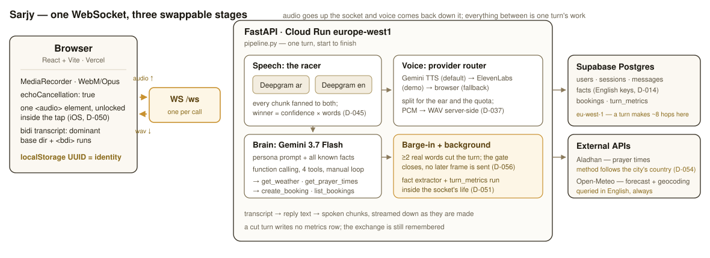

# Sarjy — a bilingual voice assistant, and what measuring it showed

Kareem Badawy · take-home for Sarj.ai · deep dive: **bilingual (Egyptian Arabic + English)**

## 1. What I built

Sarjy is a single-screen web app: tap once, then talk, like a phone call. It understands Egyptian
Arabic and English — including both inside one sentence — replies out loud in the matching
language and dialect, remembers facts about you across sessions, and can act: weather, prayer
times and bookings, including culturally-anchored ones
("احجزلي ميعاد عند الدكتور بكرة بعد العصر" → resolve Asr → book the clock time).

**Live:** <https://sarjy-kappa.vercel.app> · **API:**
<https://sarjy-api-336308540019.europe-west1.run.app/api/health> · **Repo:**
github.com/karembadawy/sarjy

**Stack:** two raced Deepgram Nova-3 streams (`ar` + `en`) → Gemini 3.7 Flash with four
function-calling tools → a TTS provider router (Gemini / ElevenLabs / browser) → Supabase
Postgres; FastAPI on Cloud Run, React on Vercel, one WebSocket between them.

## 2. The finding, up front: phonetically rough, semantically sufficient

**The transcripts my speech layer produces are bad strings and good inputs.** The two
code-switched utterances from the live gate say it better than any summary:

| # | said | winning channel's transcript | normalized WER | what Sarjy then did |
| --- | --- | --- | --- | --- |
| g1 | عايز أعمل book لميتنج بكرة الساعة خمسة | `ar` أيزعمل بوكينج لميتينج بوكرا الساعة خمسة | 71.4% | parsed the booking request and answered it |
| g2 | ايه ال weather بكرة في اسكندرية | `ar` هو الوذر بوكلا في إسكندرية يكون عملي | 100.0% | answered about the weather in Alexandria, tomorrow |

The Arabic channel writes what it hears, phonetically: "عايز أعمل" comes back as "أيزعمل" and
"بكرة" as "بوكرا". Every one of those is a word error, and a WER of 71% or 100% is a fair
description of the *string*.

It is not a fair description of the *system*. The consumer of this transcript is not a human
reader — it is Gemini, which reads straight through the transliteration and gets the booking and
the city and the day right. **WER systematically overstates the failure of a pipeline whose
reader is a language model**, because it scores spelling where only meaning has to survive.

I report the number anyway: across the five scored utterances the shipped racer is **55.6%
normalized WER** (§4). I would rather publish an unflattering number with an explanation than
invent a kinder metric.

## 3. The discovery that shaped the architecture

**Deepgram's multilingual code-switching mode does not include Arabic.** I measured that before
writing a line of pipeline code, and it invalidated the plan (D-036):

| said | `language=multi` | `language=ar` | `language=en` |
| --- | --- | --- | --- |
| عايز أعمل book لميتنج بكرة الساعة خمسة | `I examel booked limiting booked last time.` (0.61) | عايز اعمل بوك لميتنج بكره الساعه خسه (0.99) | *(empty)* |
| ابعتلي فاتورة الكهربا بكرة الصبح لو سمحت | `ए बातली फ़ातूर तिल काहराबा…` — **Devanagari** | ابعت لي فاتوره الكهرباء بكره الصبح لو سمحت | *(empty)* |
| Can you book me a table for four people tonight? | correct (1.00) | *(empty)* | correct (1.00) |

Egyptian Arabic came back as Hindi script. And no *single* setting covers the product: `ar` nails
Arabic and code-switching but returns nothing for English; `en` is the mirror image. So Sarjy
opens **one connection per language**, fans every audio chunk to both, and picks per utterance —
non-empty beats empty, and the winner is the one with the most **expected-correct words**,
confidence × word count (D-045). Cost is 2× Deepgram minutes — noise against the $200 credit.

**The accidental gift.** The monolingual Arabic model writes borrowed English in Arabic script —
`book` → بوك, `weather` → الوذر — which is exactly what my own language policy (§6.4 of the spec)
asks the *replies* to do, so the Arabic voice pronounces them naturally. Code-switching survives
as Arabic instead of being torn between two alphabets. I did not plan that; it is the reason the
gate passed.

**Second measured discovery: prerecorded and streaming Deepgram are not the same system for
Arabic** (D-063). Same `nova-3` Arabic model, same audio — the prerecorded endpoint returned
`يا يا يا يا يا يا يا يا` (114% WER) for a sentence the streaming path transcribes at 29%, and
returned nothing at all for the canonical code-switch. English is identical on both. A benchmark
built on the prerecorded API — which is what my own plan called for — would have concluded that
my Arabic channel is broken. So the harness runs the racer both ways and reports both rows; the
gap between them is the methodology caveat, measured instead of hedged about.

## 4. What was measured, and what was not

Five utterances, one live microphone, ground truth written down at the time (D-047), scored by
`eval/score_live_gate.py` under the three passes of `eval/results.md`:

| # | said | winning channel | raw | normalized | borrow-tolerant |
| --- | --- | --- | --- | --- | --- |
| g1 | عايز أعمل book لميتنج بكرة الساعة خمسة | `ar` أيزعمل بوكينج لميتينج بوكرا الساعة خمسة | 71.4% | 71.4% | 57.1% |
| g2 | ايه ال weather بكرة في اسكندرية | `ar` هو الوذر بوكلا في إسكندرية يكون عملي | 116.7% | 100.0% | 66.7% |
| g3 | Remind me to call Dina after Maghrib | `en` Remind me to call dinner tomorrow after my rib | 57.1% | 57.1% | 57.1% |
| g4 | الجو النهارده عامل ايه | `ar` الجو النهارده عامل ايه | 0.0% | 0.0% | 0.0% |
| g5 | آه يا ريت | `ar` آه يا ريت | 0.0% | 0.0% | 0.0% |

**Aggregate** (total errors ÷ total reference words, never the mean of the rates above; 27
reference words): raw **59.3%** · normalized **55.6%** · borrow-tolerant **44.4%**.

**The gap, stated plainly: the thirty-utterance study was designed and built, and never run.**
The harness is complete and tested — a recording booth using the product's own microphone
constraints, eight systems, three scoring passes, cached transcripts, the shipped race rule
*imported* rather than reimplemented, reproducible with one command. The corpus
was never recorded, so the eight-system table is empty. Nothing has been estimated or synthesised
to cover that: **an honest gap beats fake rigor.**

**The one known weakness, quantified at n=1.** An English sentence carrying Arabic proper nouns
loses them. On g3, *Dina* became *dinner* and *Maghrib* became *my rib* — while the Arabic
channel, which scored **worse** (100% WER, having romanised the English into Arabic script),
**kept both names** (دينا، مارب). The better transcript, for this product's purposes, lost the
race: `content_score` has no notion of whether a proper noun survived. Biasing the race toward
entity preservation is unproven — at n=1 any threshold over-fits this one sentence, and a bias
strong enough to flip it would hand English turns to the Arabic channel whenever a name appears.
Feeding the brain *both* transcripts needs no threshold at all, and is the one I would try first.
**I implemented neither**, because any change to the race invalidates a benchmark I do not yet
have. The four `entity` slots in `truth.csv` exist for exactly this.

## 5. Language policy as design decisions

Four rules, locked before implementation, each of which turned out to cost something:

1. **Mirror by default** — reply in the language of the last utterance; for a mixed one, the
   dominant script wins (>50% by character). It also sets the transcript's base direction in the
   UI, so one rule decides direction on both sides of the socket (D-068).
2. **An explicit switch wins and sticks** — "كلمني عربي" / "speak English" sets a stored
   preference. This rule had **never actually worked** until Phase 5: the preference was written
   only by the background fact extractor, which runs *after* the reply, so it always arrived one
   turn late. It is now recognised deterministically inside the same round trip that stores the
   user's line, and conservatively — a false negative costs one turn of mirroring, a false
   positive locks the whole call into the wrong language (D-064).
3. **Dialect, never MSA** — enforced by persona prompts built from bilingual ✅/❌ example pairs,
   not adjectives, because abstract instructions drift back to Modern Standard Arabic within a
   few turns. The first Egyptian build greeted me with **"يا هلا"** — a *Gulf* phrase — so each
   persona now names the *other* persona's vocabulary as forbidden, not only MSA. After the fix
   the same prompt answered "وعليكم السلام! إزيك، عامل إيه؟" (D-032). A persona is nothing but a
   style guide, a voice ID and a display name.
4. **Borrowed words in Arabic script** — "ميتنج", not "meeting", so the Arabic voice says it like
   an Egyptian. §3's accident means the recogniser already does this on the way in.

**Cross-language memory** is one normalization: fact *keys* are canonical English snake_case
whatever the input language (D-014). Told "اسمي كريم وبحب اللون الأزرق", the extractor stores
`favorite_color = الأزرق` with `source_language = ar` — that row is in the database now. Asked
"what's my favorite color?" in English, the brain reads that same row, because every fact is
injected into the prompt whatever language it was learned in. The key is what has to be
canonical; the value stays in the language the person said it.

## 6. The external API, justified

**Prayer times are the scheduling primitive of daily life for Sarj's actual customers.** "بكرة
بعد العصر" is how their users genuinely express a time, and turning it into a clock time requires
the Aladhan API — so the assistant calls `get_prayer_times` first, then `create_booking` with the
resolved result. On the demo utterance it books **16:58, fifteen minutes after an Asr of 16:43**
(D-055). Open-Meteo covers weather and geocoding.

Two refinements came from measuring rather than reading. The calculation method follows the
**country of the city being asked about**, not the persona (D-054): a Cairene asking "امتى العصر
في الرياض" is asking about a prayer called by Riyadh's authority — Egypt method 5, Saudi Arabia
method 4, measured for 17 Aug 2026 as Alexandria 16:43 and Riyadh 15:26, each matching its own
local timetable. And the geocoder is always queried in **English**, because "اسكندرية" resolves
to Alexandretta in *Syria* while "Alexandria" resolves to Egypt.

## 7. What broke, and what it taught me

**A two-word fragment beat a whole sentence, and Sarjy explained heart attacks** (D-045). I asked
something in Egyptian; the Arabic channel returned all eight words, the English channel returned
"Type, infarct" — and the fragment won, because 0.83 was a bigger number than the Arabic
channel's confidence. Deepgram's confidence is roughly per-word accuracy, so multiplying it by
word count approximates how much real content a channel captured: on that failure, Arabic 6.3
against English 1.66. That is the whole race rule, and it came from a live microphone.

**One sentence, answered twice** (D-046). The Arabic channel won and the turn ran; the English
channel finalised the *same* sentence 562ms later, found no race in progress, and started a fresh
one. The fix is an epoch that increments the instant a race is decided — a submission carrying a
stale epoch is dropped rather than raced.

**Deepgram hangs up on silence, which the reply itself creates** (D-041). A live connection closes
after 10 seconds without audio, and back when the microphone paused during playback, a
three-sentence reply routinely exceeded that: turn one worked, then the socket was dead and the
app was silently deaf. A 4-second KeepAlive on every channel, for the life of the session.

**The SDK's type hints lied** (D-037). `google-genai` types the TTS response format as accepting
`audio/wav`; the API answers `400`, and the path that works returns headerless PCM that no
browser will play — so the 44-byte WAV header is written server-side.

**Free tiers were a wall, not a constraint** (D-038/D-043). The brain model allowed **20 requests
per day** and TTS **10** — per model, per day. That ended a live go/no-go session after one
utterance. I measured the unit economics before spending anything: ~1,900 input + ~60 output
tokens per turn plus ~6s of synthesised audio ≈ **half a cent per spoken turn**, so a $15 credit
is ~2,700 turns. Gemini moved to paid Tier 1; everything else stayed free, and ElevenLabs stayed
rationed for the recording.

**Echo, in three layers, and the barge-in that replaced hiding from it.** Layer one is
`echoCancellation` at capture; layer two is the interrupt bar — **≥2 real words** above a
confidence floor, with punctuation, bare digits and bilingual fillers (اه، يعني, uh, um) excluded,
so a cough or echo residue cannot cut playback; layer three is demo volume hygiene, documented
rather than coded. The first version simply muted the microphone for the whole reply — safe,
half-duplex, and not a phone call. Replacing it needed three things that were only obvious once
measured (D-056): interims are armed only after synthesis starts plus a 1.0s settle window, or
the *losing* channel's leftovers interrupt the reply that answers them; the cancellation must not
`await` the dying turn, because an executor future already inside a TTS request cannot be
cancelled and held the listener for 3.0s; and exactly one of `speak_end` or `stop_speaking` is
ever sent, or a dead turn's end-signal cuts the *next* reply short.

## 8. Honest limitations

- **Memory is per-browser.** Identity is a `localStorage` UUID; clear it and Sarjy forgets you.
  Real accounts are the production path.
- **The thirty-utterance corpus was never recorded.** Everything in §4 rests on five utterances.
- **The entity-loss class is unfixed** (§4) — left visible rather than tuned against one example.
- **Deepgram's Arabic streaming model discards finals it has already shown as interims** (D-055).
  The defence that ships keeps the segment's best interim; the `Finalize` workaround cut words in
  half on a live microphone and is off by default.
- **The acceptance narrative has not been run as one scripted pass on the deployed URL.** Its
  parts have, in live sessions; the roadmap checkbox is honestly still open.
- **A daily TTS quota can still take the voice mid-call.** The designed state says so bilingually
  and hands the reply to the browser's own voice rather than going quiet (D-067).

## 9. What I'd do next, in order

1. **Record the corpus.** The harness makes it one command, and even nine utterances — three per
   group, about four minutes — produce a real table instead of an empty one.
2. **Feed the brain both channels' transcripts.** The D-047 fix I would try first: no threshold to
   tune, it fits a prompt that already tolerates rough input, and on the one case we have the
   losing channel held the names. It costs tokens every turn and risks a blended sentence neither
   channel said — which is why it waits for (1).
3. **Expose the booking tools as an MCP server**, so any agent can use them. Direct function
   calling was right for four internal tools; MCP is right the moment somebody else's agent wants
   them (D-018).
4. **Real accounts**, so memory follows the person rather than the browser.
5. **Stream the brain's reply** into the TTS chunker — the largest single block of dead air in a
   turn.
6. **Bias the race by entity preservation** — once (1) makes that threshold a measurement.

## 10. The numbers

| | value | source |
| --- | --- | --- |
| Total turn time (race decided → reply fully spoken) | median **7.05s** · p90 **19.97s** | `turn_metrics`, N = 71 turns |
| Brain (every tool round trip included) → first audio out | median **1.70s** → **6.72s** | same |
| Being understood (last word → race decided) | median **2.94s** | same |
| Cost per spoken turn | **~$0.005** ($0.0017 brain + $0.0038 voice) | D-043, measured tokens |
| Gemini budget | $15 ≈ **2,700 spoken turns** | D-043 |
| Cloud Run region, by measurement | europe-west1 **1.21s** vs us-central1 2.80s per text turn | D-049 |
| Five simultaneous calls, deployed | **5/5 answered**, 24.6s wall clock, one instance, no cross-talk | D-069 |
| Decision log at time of writing | **71 entries, 1,093 lines** | `docs/decisions.md` |

The definitions are D-057's and deliberately unflattering: every stage is timed from the instant
the race was decided, and `total_ms` runs to the end of the *spoken* reply. The rows stop minutes
after the D-070/D-071 fixes landed, so the p90 mostly records the build those entries diagnose —
a development log, not a tuned benchmark.
